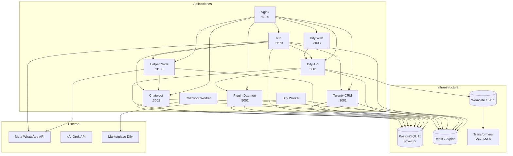

# Wibsite Business — Matriz de Dependencias

## Diagrama de Dependencias

## Matriz de Dependencias

| Servicio | Puerto Interno | Puerto Externo | Depende de | Es dependido por |
|----------|---------------|----------------|------------|------------------|
| PostgreSQL | 5432 | - | - | chatwoot, dify-api, dify-worker, n8n, twenty-server, plugin-daemon, helper |
| Redis | 6379 | - | - | chatwoot, chatwoot-worker, dify-api, dify-worker, n8n, twenty-server, plugin-daemon |
| Weaviate | 8080 | - | t2v-transformers | dify-api |
| Transformers | 8080 | - | - | weaviate |
| Chatwoot | 3000 | 3002 | postgres, redis | n8n, nginx, helper |
| Chatwoot Worker | - | - | postgres, redis | - |
| Dify API | 5001 | 5001 | postgres, redis, weaviate, plugin-daemon | dify-web, dify-worker, n8n, nginx |
| Dify Web | 3000 | 3003 | dify-api | nginx |
| Dify Worker | - | - | postgres, redis, dify-api | - |
| Plugin Daemon | 5002 | 5002 | postgres, redis, marketplace.dify.ai | dify-api, nginx |
| n8n | 5678 | 5679 | postgres, redis | nginx |
| Twenty CRM | 3000 | 3001 | postgres, redis | n8n, nginx |
| Helper Node | 3100 | 3100 | postgres | n8n, nginx |
| Nginx | 80 | 8080 | dify-web, n8n, twenty-server, helper, dify-api, plugin-daemon (chatwoot runtime-only) | - |

## Versiones Compatibles

| Servicio | Versión Actual | Versión Mínima | Notas |
|----------|---------------|----------------|-------|
| PostgreSQL | 15 (pgvector) | 14 | pgvector requerido para Dify |
| Redis | 7 Alpine | 6 | |
| Weaviate | 1.26.1 | 1.24 | Con módulo text2vec-transformers |
| Transformers | sentence-transformers-multi-qa-MiniLM-L6-cos-v1 | - | Fijo, no actualizar sin verificar compatibilidad |
| Chatwoot | latest | v3.x | Usar imagen latest estable |
| Dify API | 1.15.x | 1.15.0 | Sistema solo plugins |
| Dify Web | 1.15.x | 1.15.0 | Debe coincidir con dify-api |
| Plugin Daemon | 0.6.3-local | 0.6.x | local build para compatibilidad |
| n8n | latest | 1.x | Usar imagen latest estable |
| Twenty CRM | latest | v0.30+ | |
| Node (helper) | 20 Alpine | 18 | |

## Health Checks

| Servicio | Endpoint Health Check | Puerto |
|----------|----------------------|--------|
| PostgreSQL | `pg_isready -U wibsite` (docker) | 5432 |
| Redis | `redis-cli ping` (docker) | 6379 |
| Weaviate | `GET /v1/.well-known/ready` | 8080 |
| Chatwoot | `GET /health` | 3000 |
| Dify API | `GET /health` | 5001 |
| Plugin Daemon | `GET /health` (via dify-api) | 5002 |
| n8n | `GET /healthz` | 5678 |
| Twenty CRM | `GET /healthz` | 3000 |
| Helper | `GET /health` | 3100 |
| Nginx | `GET /health` | 80 |
