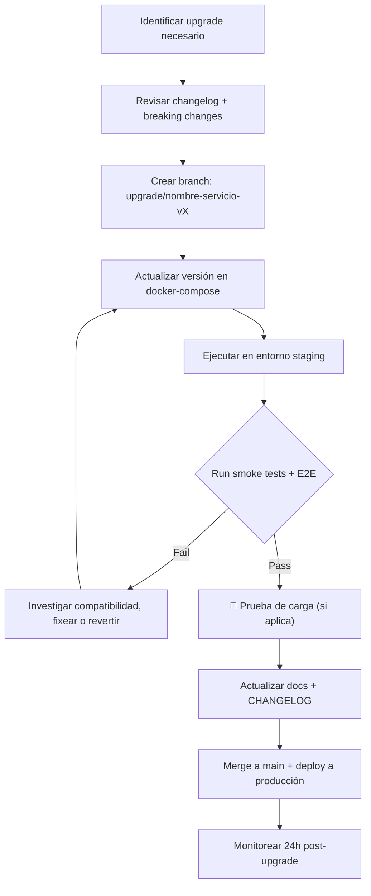

# Wibsite Business — OPS-MASTER: Operaciones y DevOps

> **Versión:** 1.0 — Julio 2026
> **Propósito:** Definir la arquitectura operativa, estrategia de despliegue multi-tenant, CI/CD, monitoreo y disaster recovery para un sistema SaaS de mensajería omnicanal con IA.
> **Alcance:** Hasta etapa previa al despliegue (sin elección de nube/proveedor).
> **Arquitectura:** Microservicios descentralizados con orquestación para multi-inquilino (empresas → sucursales → usuarios).

---

## Índice

1. [Arquitectura de Microservicios Multi-Tenant](#1-arquitectura-de-microservicios-multi-tenant)
2. [Modelo de Datos Multi-Inquilino](#2-modelo-de-datos-multi-inquilino)
3. [Estrategia de Despliegue y Orquestación](#3-estrategia-de-despliegue-y-orquestación)
4. [Pipeline CI/CD](#4-pipeline-cicd)
5. [Monitoreo y Alertas](#5-monitoreo-y-alertas)
6. [Backup y Disaster Recovery](#6-backup-y-disaster-recovery)
7. [Gestión de Versiones y Upgrades](#7-gestión-de-versiones-y-upgrades)
8. [Estrategia de Escalamiento](#8-estrategia-de-escalamiento)
9. [Hardening Pre-Despliegue](#9-hardening-pre-despliegue)
10. [Matriz de Responsabilidades Operativas](#10-matriz-de-responsabilidades-operativas)

---

## 1. Arquitectura de Microservicios Multi-Tenant

### 1.1 Jerarquía de Inquilinos

```
PLATFORM (Wibsite Inc.)
    │
    ├── TENANT A (Empresa: "TechCorp SRL")
    │   │
    │   ├── BRANCH A1 (Sucursal: "La Paz Central")
    │   │   ├── User A1_1 (admin)
    │   │   ├── User A1_2 (agent)
    │   │   └── User A1_3 (agent)
    │   │
    │   └── BRANCH A2 (Sucursal: "Santa Cruz")
    │       ├── User A2_1 (admin)
    │       └── User A2_2 (agent)
    │
    ├── TENANT B (Empresa: "Pastelería Delicias")
    │   └── BRANCH B1 (Única)
    │       └── User B1_1 (admin + agent)
    │
    └── TENANT C (Empresa: "Servicios Jurídicos ABC")
        └── BRANCH C1 (Sucursal: "Oficina Central")
            ├── User C1_1 (admin)
            ├── User C1_2 (agent)
            └── User C1_3 (paralegal)
```

### 1.2 Modelo de Capas Multi-Tenant

```
Capa 0 — PLATFORM (Wibsite)
├── Infraestructura compartida
├── Facturación y billing
├── Monitoreo cross-tenant
├── Tabla maestra de tenants
└── Administración del sistema

Capa 1 — TENANT (Empresa)
├── Datos de la empresa (nombre, industria, logo)
├── Configuración del agente (contexto, personalidad, productos)
├── Suscripción y límites del plan
├── Usuarios y roles
├── API keys propias
└── Preferencias de facturación

Capa 2 — BRANCH (Sucursal)
├── Leads y contactos de la sucursal
├── Campañas de la sucursal
├── Conversaciones de la sucursal
├── Números de teléfono WhatsApp asignados
├── Configuración local (horario, zona horaria)
└── Métricas de la sucursal

Capa 3 — USER (Usuario/Agente)
├── Perfil y credenciales
├── Conversaciones asignadas
├── Actividad y rendimiento individual
├── Preferencias personales (idioma, notificaciones)
└── Permisos específicos
```

### 1.3 Estrategias de Aislamiento por Servicio

| Servicio | Estrategia | Justificación |
|----------|-----------|---------------|
| **PostgreSQL** | Schema por tenant + RLS | Costo eficiente, PostgreSQL soporta miles de schemas. RLS asegura aislamiento. |
| **Redis** | Prefijo de keys por tenant | Redis no tiene multi-tenancy nativo. `{tenant_id}:{branch_id}:{key}`. |
| **Weaviate** | Clase por tenant + filtro where | Cada tenant tiene su propia clase `DocumentChunk_{tenantId}`. |
| **Chatwoot** | Cuenta por tenant | Chatwoot soporta multi-cuenta nativamente con aislamiento completo. |
| **Dify** | Workspace por tenant | Dify soporta multi-workspace. Cada tenant tiene su propio workspace y API key. |
| **n8n** | Proyecto por tenant | n8n Projects permite aislar workflows y credenciales por tenant. |
| **Twenty CRM** | Workspace por tenant | Twenty soporta multi-workspace con datos completamente aislados. |
| **Helper Node** | Store en memoria con prefijo + DB con tenant_id | Aislamiento en código vía middleware `tenantContext`. |
| **Archivos multimedia** | Directorio por tenant | `storage/{tenant_id}/{branch_id}/{type}/{file}` |

### 1.4 Microservicios y Comunicación

```
                    ┌─────────────────────┐
                    │   API GATEWAY        │
                    │  (Kong / Nginx +     │
                    │   Authelia)          │
                    │  Rate limiting x     │
                    │  tenant. Auth JWT.   │
                    │  Ruteo x tenant_id   │
                    └────────┬────────────┘
                             │
              ┌──────────────┼──────────────┐
              ▼              ▼              ▼
      ┌────────────┐ ┌────────────┐ ┌────────────┐
      │ Chatwoot   │ │   Dify     │ │    n8n     │
      │ (Cuenta x  │ │ (Workspace │ │ (Proyecto  │
      │  tenant)   │ │  x tenant) │ │  x tenant) │
      └────────────┘ └────────────┘ └────────────┘
              │              │              │
              └──────────────┼──────────────┘
                             ▼
                    ┌─────────────────────┐
                    │   HELPER-NODE        │
                    │  (Microservicio      │
                    │   central)           │
                    │  + PostgreSQL RLS    │
                    │  + Redis prefixed    │
                    └────────┬────────────┘
                             │
              ┌──────────────┼──────────────┐
              ▼              ▼              ▼
      ┌────────────┐ ┌────────────┐ ┌────────────┐
      │ PostgreSQL │ │   Redis    │ │  Weaviate  │
      │  (RLS x    │ │ (prefijo x │ │ (Clase x   │
      │   tenant)  │ │  tenant)   │ │  tenant)   │
      └────────────┘ └────────────┘ └────────────┘
```

### 1.5 API Gateway (Kong / Nginx Plus)

```nginx
# OPS-MASTER — API Gateway configuration pattern
upstream helper {
    server helper:3100;
}

upstream chatwoot {
    server chatwoot:3000;
}

# Rate limiting por tenant (identificado por API key o JWT)
limit_req_zone $tenant_id zone=tenant_api:10m rate=100r/m;

server {
    listen 443 ssl;
    server_name api.wibsite.com;

    # Auth + Tenant resolution
    auth_request /auth;

    location = /auth {
        internal;
        proxy_pass http://authelia:9091/api/authz/auth-request;
        proxy_pass_request_body off;
        proxy_set_header Content-Length "";
    }

    location /api/v1/ {
        # Resolver tenant_id del JWT
        auth_request_set $tenant_id $upstream_http_x_tenant_id;
        limit_req zone=tenant_api burst=20;

        # Inyectar tenant_id en headers para downstream
        proxy_set_header X-Tenant-ID $tenant_id;
        proxy_pass http://helper;
    }

    location /chatwoot/ {
        # Proxy a la cuenta de Chatwoot del tenant
        rewrite ^/chatwoot/(.*) /$1 break;
        proxy_pass http://chatwoot;
    }
}
```

---

## 2. Modelo de Datos Multi-Inquilino

### 2.1 Tabla Maestra de Tenants

```sql
-- Tabla central compartida (base de datos wibsite, schema public)
CREATE TABLE platform_tenants (
    id UUID PRIMARY KEY DEFAULT gen_random_uuid(),
    name VARCHAR(255) NOT NULL,
    slug VARCHAR(100) UNIQUE NOT NULL, -- para subdominio: tenant.wibsite.com
    industry VARCHAR(100), -- gimnasio, pastelería, electrodomésticos, servicios, etc.
    plan_id VARCHAR(50) NOT NULL, -- 'demo', 'blue', 'promax', 'enterprise'
    is_active BOOLEAN DEFAULT true,
    onboarding_completed BOOLEAN DEFAULT false,
    config JSONB DEFAULT '{}', -- contexto del agente, personalidad, etc.
    created_at TIMESTAMPTZ DEFAULT NOW(),
    -- Límites del plan (denormalizado para rendimiento, source of truth en tabla suscripciones)
    max_branches INT DEFAULT 1,
    max_users INT DEFAULT 1,
    max_leads INT DEFAULT 100,
    max_conversations_month INT DEFAULT 500,
    features JSONB DEFAULT '{}', -- {voice_calls: false, multi_agent: false, rag: false}
    -- Billing
    stripe_customer_id VARCHAR(100),
    stripe_subscription_id VARCHAR(100),
    subscription_status VARCHAR(50) DEFAULT 'inactive',
    trial_ends_at TIMESTAMPTZ,
    -- Metadata
    metadata JSONB DEFAULT '{}'
);

CREATE TABLE platform_branches (
    id UUID PRIMARY KEY DEFAULT gen_random_uuid(),
    tenant_id UUID NOT NULL REFERENCES platform_tenants(id) ON DELETE CASCADE,
    name VARCHAR(255) NOT NULL,
    timezone VARCHAR(50) DEFAULT 'America/La_Paz',
    phone_number_id VARCHAR(100), -- Número WhatsApp asignado a esta sucursal
    config JSONB DEFAULT '{}',
    is_active BOOLEAN DEFAULT true,
    created_at TIMESTAMPTZ DEFAULT NOW()
);

CREATE TABLE platform_users (
    id UUID PRIMARY KEY DEFAULT gen_random_uuid(),
    tenant_id UUID NOT NULL REFERENCES platform_tenants(id) ON DELETE CASCADE,
    branch_id UUID REFERENCES platform_branches(id) ON DELETE SET NULL,
    email VARCHAR(255) UNIQUE NOT NULL,
    password_hash VARCHAR(255) NOT NULL,
    name VARCHAR(255) NOT NULL,
    role VARCHAR(50) NOT NULL DEFAULT 'agent', -- 'admin', 'agent', 'readonly'
    is_active BOOLEAN DEFAULT true,
    last_login_at TIMESTAMPTZ,
    preferences JSONB DEFAULT '{}',
    created_at TIMESTAMPTZ DEFAULT NOW()
);
```

### 2.2 Row Level Security (RLS) en PostgreSQL

```sql
-- Cada tabla de negocio tiene tenant_id
-- Ejemplo para la tabla de leads:

CREATE TABLE leads (
    id UUID PRIMARY KEY DEFAULT gen_random_uuid(),
    tenant_id UUID NOT NULL REFERENCES platform_tenants(id) ON DELETE CASCADE,
    branch_id UUID REFERENCES platform_branches(id),
    -- ... resto de columnas
);

-- Habilitar RLS
ALTER TABLE leads ENABLE ROW LEVEL SECURITY;

-- Política de aislamiento
CREATE POLICY lead_tenant_isolation ON leads
    USING (tenant_id = current_setting('app.tenant_id')::UUID);

-- El middleware de helper-node setea:
-- SET app.tenant_id = 'uuid-del-tenant';
```

---

## 3. Estrategia de Despliegue y Orquestación

### 3.1 Estados del Despliegue (Pre-Producción)

```
DESARROLLO (dev.wibsite.com)
├── developer builds
├── datos mock (seed)
├── sin SSL (HTTP)
├── sin backups automáticos
├── sin monitoreo
└── propósito: desarrollo de features

STAGING (staging.wibsite.com)
├── CI/CD automático desde develop
├── datos anonimizados de producción
├── SSL con Let's Encrypt
├── backups diarios automáticos
├── monitoreo activo (alertas en Slack)
├── pruebas E2E automatizadas
└── propósito: validación pre-producción

PRODUCCIÓN (app.wibsite.com)
├── CI/CD desde main con aprobación manual
├── datos reales de clientes
├── SSL con certificado enterprise
├── backups cada 6h + WAL continuo
├── monitoreo 24/7 con alertas P0/P1
├── DR plan probado semestralmente
└── propósito: sistema en vivo
```

### 3.2 Orquestación de Contenedores

```
Opción A: Docker Compose (MVP / hasta 5 tenants)
├── Simple, probado actualmente
├── Escalamiento: docker compose up -d --scale helper=3
├── Límite: ~5-10 tenants, sin auto-remediation
├── Monitoring con prometheus + cadvisor
└── Upgrade: docker compose pull && docker compose up -d

Opción B: Docker Swarm (crecimiento medio / 10-50 tenants)
├── Nativo con Docker, baja curva de aprendizaje
├── Servicios distribuidos en 3-5 nodos
├── Rolling updates automáticos
├── Secrets management nativo
├── Redes overlay para aislamiento
└── Límite: ~50-100 tenants

Opción C: Kubernetes (escala completa / 100+ tenants)
├── Auto-scaling, self-healing, service mesh
├── Namespaces por tenant (aislamiento extremo)
├── Istio/Linkerd para mTLS entre servicios
├── Helm charts para despliegues repetibles
├── Operators para backups, upgrades
└── Complejidad alta, requiere equipo dedicado
```

### 3.3 Estructura de Directorios del Repositorio

```
wibsite/
├── platform/                     # Código de la plataforma
│   ├── helper-node/              # Microservicio central
│   │   ├── src/
│   │   ├── Dockerfile
│   │   ├── package.json
│   │   └── tests/
│   ├── web-portal/               # Shell UI (portal unificado)
│   │   ├── src/
│   │   ├── Dockerfile
│   │   └── package.json
│   ├── voice-service/            # Microservicio de voz/llamadas
│   │   ├── src/
│   │   └── Dockerfile
│   └── agent-config/             # Microservicio de configuración de agente
│       ├── src/
│       └── Dockerfile
│
├── infra/                        # Infraestructura como código
│   ├── docker-compose/           # Docker Compose files
│   │   ├── docker-compose.yml    # Base
│   │   ├── docker-compose.monitoring.yml
│   │   └── docker-compose.prod.yml
│   ├── kubernetes/               # K8s manifests (futuro)
│   │   ├── namespaces/
│   │   ├── deployments/
│   │   └── services/
│   ├── nginx/                    # Nginx configs multi-entorno
│   │   ├── nginx.conf.dev
│   │   ├── nginx.conf.staging
│   │   └── nginx.conf.prod
│   └── terraform/                # Infraestructura cloud (futuro)
│       ├── main.tf
│       └── variables.tf
│
├── scripts/                      # Automatización
│   ├── ci/                       # Scripts de CI/CD
│   │   ├── build.sh
│   │   ├── test.sh
│   │   └── deploy.sh
│   ├── db/                       # Migraciones y seeds
│   │   ├── migrations/
│   │   └── seeds/
│   └── ops/                      # Operaciones
│       ├── backup.sh
│       ├── restore.sh
│       └── healthcheck.sh
│
├── docs/                         # Documentación
└── specs/                        # Especificaciones
```

---

## 4. Pipeline CI/CD

### 4.1 Flujo de CI/CD (GitHub Actions / GitLab CI)

```yaml
# .github/workflows/deploy.yml — Pipeline CI/CD
name: Wibsite CI/CD Pipeline

on:
  push:
    branches: [develop, main]
  pull_request:
    branches: [main]

jobs:
  # ─── FASE 1: VALIDACIÓN ──────────────────────────
  lint:
    runs-on: ubuntu-latest
    steps:
      - uses: actions/checkout@v3
      - name: Lint helper-node
        run: cd platform/helper-node && npm run lint
      - name: Lint web-portal
        run: cd platform/web-portal && npm run lint
      - name: Validate docker-compose
        run: docker compose -f infra/docker-compose/docker-compose.yml config

  test:
    needs: lint
    runs-on: ubuntu-latest
    steps:
      - uses: actions/checkout@v3
      - name: Unit tests helper-node
        run: cd platform/helper-node && npm test
      - name: Integration tests
        run: cd scripts/ci && ./test.sh
      - name: Security audit
        run: cd platform/helper-node && npm audit --production
      - name: Dependency vulnerability scan
        uses: snyk/actions/node@master
        env:
          SNYK_TOKEN: ${{ secrets.SNYK_TOKEN }}

  # ─── FASE 2: CONSTRUCCIÓN ────────────────────────
  build:
    needs: test
    runs-on: ubuntu-latest
    steps:
      - uses: actions/checkout@v3
      - name: Build helper-node image
        run: docker build -t wibsite/helper:${{ github.sha }} ./platform/helper-node
      - name: Build web-portal image
        run: docker build -t wibsite/portal:${{ github.sha }} ./platform/web-portal
      - name: Push to registry
        run: |
          docker tag wibsite/helper:${{ github.sha }} registry.wibsite.com/helper:latest
          docker push registry.wibsite.com/helper:${{ github.sha }}

  # ─── FASE 3: DESPLIEGUE ──────────────────────────
  deploy-staging:
    if: github.ref == 'refs/heads/develop'
    needs: build
    runs-on: ubuntu-latest
    environment: staging
    steps:
      - name: Deploy to staging
        run: |
          ssh deploy@staging.wibsite.com "
            cd /opt/wibsite &&
            docker compose pull &&
            docker compose up -d --force-recreate &&
            docker system prune -f
          "
      - name: Smoke tests
        run: |
          sleep 10
          curl -f http://staging.wibsite.com/api/health
          curl -f http://staging.wibsite.com/n8n/healthz

  deploy-production:
    if: github.ref == 'refs/heads/main'
    needs: [build, deploy-staging]
    runs-on: ubuntu-latest
    environment: production
    steps:
      - name: Manual approval gate
        uses: trstringer/manual-approval@v1
        with:
          secret: ${{ secrets.APPROVAL_TOKEN }}
          approvers: admin1,admin2
          minimum-approvals: 2
      - name: Deploy to production (rolling update)
        run: |
          ssh deploy@app.wibsite.com "
            cd /opt/wibsite &&
            docker compose pull &&
            docker compose up -d --no-deps --scale helper=3 helper &&
            docker compose up -d --no-deps portal &&
            docker system prune -f
          "
      - name: Post-deploy verification
        run: |
          ./scripts/ci/verify-deployment.sh production
      - name: Notify team
        uses: slackapi/slack-github-action@v1
        with:
          payload: |
            {
              "text": "🚀 Wibsite deployed to PRODUCTION - ${{ github.sha }}"
            }
```

### 4.2 Verificación Post-Despliegue

```bash
#!/bin/bash
# scripts/ci/verify-deployment.sh — Smoke tests post-deploy

ENV=${1:-staging}
BASE_URL="https://$ENV.wibsite.com"
FAILED=0

echo "🔍 Verifying deployment on $ENV..."
echo ""

# 1. Health endpoints
for service in helper n8n dify chatwoot twenty; do
  STATUS=$(curl -so /dev/null -w "%{http_code}" "$BASE_URL/$service/health" 2>/dev/null || echo "000")
  if [ "$STATUS" = "200" ] || [ "$STATUS" = "000" ]; then
    # n8n usa /healthz, helper usa /api/health, etc.
    STATUS=$(curl -so /dev/null -w "%{http_code}" "$BASE_URL/$service/healthz" 2>/dev/null || echo "000")
  fi
  if [ "$STATUS" = "200" ]; then
    echo "  ✅ $service — $STATUS"
  else
    echo "  ❌ $service — $STATUS"
    FAILED=$((FAILED+1))
  fi
done

# 2. API core endpoints
echo ""
echo "📡 Core API..."
for endpoint in "/api/health" "/api/dashboard/summary"; do
  STATUS=$(curl -so /dev/null -w "%{http_code}" "$BASE_URL$endpoint")
  if [ "$STATUS" = "200" ]; then
    echo "  ✅ $endpoint — $STATUS"
  else
    echo "  ❌ $endpoint — $STATUS"
    FAILED=$((FAILED+1))
  fi
done

# 3. Authentication (SSO)
echo ""
echo "🔐 SSO..."
STATUS=$(curl -so /dev/null -w "%{http_code}" -b "session=test" "$BASE_URL/auth/validate")
if [ "$STATUS" != "403" ]; then
  echo "  ✅ SSO auth endpoint reachable — $STATUS"
else
  echo "  ⚠️  SSO requires session — $STATUS (expected)"
fi

# 4. Dify workflow execution
echo ""
echo "🧠 Dify workflow..."
RESULT=$(curl -s -X POST "$BASE_URL/dify/v1/workflows/run" \
  -H "Authorization: Bearer $DIFY_API_KEY" \
  -H "Content-Type: application/json" \
  -d '{"inputs":{"message":"test"},"response_mode":"blocking","user":"test"}')
if echo "$RESULT" | grep -q "succeeded"; then
  echo "  ✅ Dify workflow executes correctly"
else
  echo "  ❌ Dify workflow failed"
  FAILED=$((FAILED+1))
fi

echo ""
if [ $FAILED -eq 0 ]; then
  echo "✅ ALL CHECKS PASSED — Deployment successful"
  exit 0
else
  echo "❌ $FAILED CHECKS FAILED — Rolling back recommended"
  exit 1
fi
```

---

## 5. Monitoreo y Alertas

### 5.1 Stack de Monitoreo

```
Prometheus (metrics)
    ↑
    ├── cAdvisor → métricas de contenedores (CPU, RAM, disco, red)
    ├── node_exporter → métricas del host
    ├── postgres_exporter → métricas de PostgreSQL
    └── blackbox_exporter → health checks externos
    │
    ▼
Grafana (dashboards)
    ├── Dashboard: "Wibsite Health Overview"
    │   ├── Uptime de cada servicio (99.9% SLO)
    │   ├── Latencia p95 por endpoint
    │   ├── Tasa de error por servicio
    │   ├── Conexiones activas por tenant
    │   └── Uso de recursos (CPU, RAM, disco)
    │
    ├── Dashboard: "Tenant Metrics"
    │   ├── Leads creados/hora por tenant
    │   ├── Conversaciones activas por tenant
    │   ├── Mensajes procesados/minuto
    │   ├── Llamadas activas (cuando implementado)
    │   └── Costo estimado de IA por tenant
    │
    └── Dashboard: "Business KPIs"
        ├── Tasa de conversión lead → lead calificado
        ├── Tasa de respuesta de campañas
        ├── Precisión de clasificación IA
        └── Tiempo promedio de respuesta

Loki (logs)
    ├── Logs estructurados de helper-node (JSON)
    ├── Logs de n8n executions
    ├── Logs de Dify workflow runs
    └── Logs de Nginx access/error

Alertmanager (alertas)
    ├── P0: Servicio caído → SMS + Slack + Email
    ├── P1: Latencia >5s → Slack + Email
    ├── P2: Tasa de error >5% → Slack
    └── P3: Disco >80% → Email (daily report)
```

### 5.2 Alertas Críticas (P0/P1)

```yaml
# Alertmanager rules
groups:
  - name: wibsite-critical
    rules:
      - alert: ServiceDown
        expr: up{job=~"helper|nginx|postgres|redis"} == 0
        for: 30s
        labels: { severity: critical }
        annotations:
          summary: "{{ $labels.job }} is down on {{ $labels.instance }}"

      - alert: HighLatency
        expr: histogram_quantile(0.95, rate(http_request_duration_seconds_bucket{job="helper"}[5m])) > 5
        for: 2m
        labels: { severity: high }
        annotations:
          summary: "Helper API p95 latency > 5s"

      - alert: HighErrorRate
        expr: rate(http_requests_total{status=~"5.."}[5m]) / rate(http_requests_total[5m]) > 0.05
        for: 5m
        labels: { severity: high }
        annotations:
          summary: "Error rate > 5% on helper API"

      - alert: DiskFull
        expr: (node_filesystem_avail_bytes{mountpoint="/"} / node_filesystem_size_bytes{mountpoint="/"}) < 0.2
        for: 5m
        labels: { severity: high }
        annotations:
          summary: "Disk space < 20% on {{ $labels.instance }}"

      - alert: RedisMemoryHigh
        expr: redis_memory_used_bytes / redis_memory_max_bytes > 0.8
        for: 2m
        labels: { severity: high }
        annotations:
          summary: "Redis memory usage > 80%"
```

### 5.3 Healthchecks Docker

```yaml
# docker-compose.yml — healthchecks para auto-remediation
services:
  postgres:
    healthcheck:
      test: ["CMD-SHELL", "pg_isready -U wibsite"]
      interval: 10s
      timeout: 5s
      retries: 5
      start_period: 30s

  redis:
    healthcheck:
      test: ["CMD", "redis-cli", "ping"]
      interval: 10s
      timeout: 3s
      retries: 5

  helper:
    healthcheck:
      test: ["CMD", "node", "-e", "require('http').get('http://localhost:3100/health', r => process.exit(r.statusCode===200?0:1))"]
      interval: 15s
      timeout: 5s
      retries: 3
      start_period: 10s

  n8n:
    healthcheck:
      test: ["CMD", "node", "-e", "require('http').get('http://localhost:5678/healthz', r => process.exit(r.statusCode===200?0:1))"]
      interval: 15s
      timeout: 5s
      retries: 3
```

---

## 6. Backup y Disaster Recovery

### 6.1 Estrategia de Backup

| Dato | Frecuencia | Retención | Método | Tamaño estimado |
|------|-----------|-----------|--------|-----------------|
| PostgreSQL (todas las DBs) | Cada 6h | 7 días diario + 4 semanas semanal | `pg_dump` comprimido + WAL continuo | ~500MB-2GB |
| Redis (conversaciones activas) | Cada 1h | 24h | `SAVE` + backup de dump.rdb | ~50-200MB |
| Weaviate (vectores) | Cada 12h | 7 días | API export + backup de disco | ~1-5GB |
| Archivos multimedia | Diario | 7 días | rsync a storage secundario | ~10-50GB |
| Configuración (docker-compose, .env, nginx) | Cada cambio commit | Historial de git | Git | <1MB |
| JSON store (fallback) | Cada hora | 48h | `cp` con timestamp | ~1-10MB |

### 6.2 Script de Backup Unificado

```bash
#!/bin/bash
# scripts/ops/backup.sh — Backup unificado

BACKUP_DIR="/backups/$(date +%Y-%m-%d)"
mkdir -p "$BACKUP_DIR"

echo "🗄️  Starting backup: $(date)"

# 1. PostgreSQL — backup de todas las bases
echo "  📦 PostgreSQL..."
docker compose exec -T postgres pg_dump -U wibsite -d chatwoot | gzip > "$BACKUP_DIR/chatwoot.sql.gz"
docker compose exec -T postgres pg_dump -U wibsite -d dify | gzip > "$BACKUP_DIR/dify.sql.gz"
docker compose exec -T postgres pg_dump -U wibsite -d n8n | gzip > "$BACKUP_DIR/n8n.sql.gz"
docker compose exec -T postgres pg_dump -U wibsite -d twenty | gzip > "$BACKUP_DIR/twenty.sql.gz"
docker compose exec -T postgres pg_dump -U wibsite -d wibsite | gzip > "$BACKUP_DIR/wibsite.sql.gz"

# 2. Redis
echo "  ⚡ Redis..."
docker compose exec redis redis-cli SAVE
docker compose cp redis:/data/dump.rdb "$BACKUP_DIR/redis.rdb"

# 3. Config files
echo "  ⚙️  Config..."
cp docker-compose.yml "$BACKUP_DIR/"
cp .env "$BACKUP_DIR/"
cp nginx.conf "$BACKUP_DIR/"

# 4. JSON store (fallback)
echo "  📄 JSON store..."
cp helper-node/wibsite-store.json "$BACKUP_DIR/" 2>/dev/null || true

# 5. Media files (incremental snapshot)
echo "  🖼️  Media..."
rsync -a --link-dest=/backups/$(date -d yesterday +%Y-%m-%d) \
  helper-node/storage/ "$BACKUP_DIR/storage/" 2>/dev/null || true

# 6. Verificar integridad
echo "  ✅ Verifying..."
for f in "$BACKUP_DIR"/*.sql.gz; do
  gunzip -t "$f" || echo "  ❌ Corrupted: $f"
done

# 7. Limpiar backups antiguos (>30 días)
find /backups -type d -mtime +30 -exec rm -rf {} \; 2>/dev/null || true

echo "✅ Backup complete: $(date)"
echo "   Location: $BACKUP_DIR"
echo "   Size: $(du -sh $BACKUP_DIR | cut -f1)"
```

### 6.3 Disaster Recovery Plan

```
NIVEL 1: FALLO DE SERVICIO (caída de un contenedor)
├── Síntoma: Health check falla, alerta P1
├── Tiempo recovery: < 1 minuto
├── Acción: Docker restart policy (restart: unless-stopped) lo reinicia automáticamente
└── Verificación: Health check pasa, alerta se resuelve sola

NIVEL 2: FALLO DE NODO (caída del servidor)
├── Síntoma: Servicio completamente inaccesible, alerta P0
├── Tiempo recovery: < 15 minutos
├── Acción:
│   1. ssh al nodo de respaldo
│   2. docker compose up -d (si el volumen de datos está en storage compartido)
│   3. O restaurar desde backup en un nodo nuevo
└── Verificación: Smoke tests automáticos, verificar integridad de datos

NIVEL 3: CORRUPCIÓN DE DATOS (bug, ataque, error humano)
├── Síntoma: Datos inconsistentes, leads duplicados, scoring incorrecto
├── Tiempo recovery: < 2 horas
├── Acción:
│   1. Identificar el alcance (qué datos, desde cuándo)
│   2. Restaurar PostgreSQL desde backup más reciente no corrupto
│   3. Restaurar Redis (conversaciones activas perdidas, notificar a usuarios)
│   4. Re-indexar Weaviate desde la KB
│   5. Verificar consistencia con Twenty CRM
└── Verificación: Comparar conteos de registros, ejecutar tests de integridad

NIVEL 4: DESASTRE TOTAL (pérdida del datacenter completo)
├── Síntoma: Cero acceso, todos los servicios caídos
├── Tiempo recovery: < 24 horas
├── Requisito previo: Backups en región/cloud diferente
├── Acción:
│   1. Provisionar nueva infraestructura (seguir setup guide)
│   2. Restaurar desde el backup más reciente
│   3. Configurar DNS para apuntar a la nueva IP
│   4. Verificar cada servicio con smoke tests
│   5. Notificar a todos los tenants del incidente
└── Verificación: Prueba de DR semestral con restauración completa
```

---

## 7. Gestión de Versiones y Upgrades

### 7.1 Estrategia de Versionado

```
wibsite/helper-node: v2.1.1           → SemVer para microservicios
wibsite/portal: v1.0.0                → Versión independiente del helper
chatwoot/chatwoot: v3.14.0            → Pinear versiones, no usar :latest
langgenius/dify-api: v1.0.0           → Pinear versiones
n8nio/n8n: v1.73.0                    → Evaluar antes de upgrade (body parser bug)
twentycrm/twenty: v0.46.0             → Pinear versiones
```

### 7.2 Proceso de Upgrade de Servicio



---

## 8. Estrategia de Escalamiento

### 8.1 Cuándo Escalar Cada Componente

| Componente | Señal de escalar | Acción |
|-----------|------------------|--------|
| **PostgreSQL** | CPU >70%, conexiones >200, lecturas lentas | Read replicas, connection pooling (PgBouncer), sharding por tenant |
| **Redis** | Memoria >80%, hits <90% | Cluster mode, aumentar maxmemory |
| **Helper Node** | Latencia p95 >1s, CPU >80% | Escalamiento horizontal (más réplicas), cache en Redis |
| **Dify** | Workflows encolados, latencia >10s | Más workers, aumentar concurrencia de LLM |
| **n8n** | Ejecuciones encoladas, webhooks lentos | Queue mode, más workers |
| **Weaviate** | Consultas vectoriales lentas | Más réplicas de Weaviate, optimizar chunking |
| **Chatwoot** | Conversaciones concurrentes >500 | Más workers Sidekiq, más servidores web |

### 8.2 Auto-Scaling (Kubernetes / Docker Swarm)

```yaml
# docker-compose.prod.yml — configuración de escalamiento
services:
  helper:
    deploy:
      mode: replicated
      replicas: 3  # Base, auto-escala hasta 10
      resources:
        limits:
          cpus: '1'
          memory: '512M'
        reservations:
          cpus: '0.25'
          memory: '256M'

  n8n:
    deploy:
      mode: replicated
      replicas: 2
      resources:
        limits:
          cpus: '2'
          memory: '1G'

  dify-worker:
    deploy:
      mode: replicated
      replicas: 2
      resources:
        limits:
          cpus: '2'
          memory: '2G'
```

---

## 9. Hardening Pre-Despliegue

### 9.1 Checklist de Validación Pre-Producción

```
[N ] SECCIÓN 1: INFRAESTRUCTURA
    [ ] 1.1 Todos los contenedores corren como usuario no-root
    [ ] 1.2 Resource limits configurados en todos los servicios
    [ ] 1.3 Redes Docker segmentadas (frontend, backend, data, ai)
    [ ] 1.4 Health checks configurados en todos los servicios críticos
    [ ] 1.5 Política de restart: unless-stopped en todos
    [ ] 1.6 Logging driver configurado (json-file con límite de tamaño)
    [ ] 1.7 Timeouts configurados en todas las comunicaciones HTTP

[N ] SECCIÓN 2: SEGURIDAD
    [ ] 2.1 SSL/TLS configurado (certificado válido, no self-signed)
    [ ] 2.2 Authelia/SSO activo y probado con todos los módulos
    [ ] 2.3 API keys rotadas (no usar las de desarrollo)
    [ ] 2.4 CORS configurado con orígenes específicos
    [ ] 2.5 Rate limiting configurado en API Gateway
    [ ] 2.6 Security headers en Nginx (CSP, X-Frame-Options, HSTS)
    [ ] 2.7 Webhook HMAC verification implementada
    [ ] 2.8 No hay secretos hardcodeados en docker-compose.yml
    [ ] 2.9 Docker secrets usados para credenciales sensibles

[N ] SECCIÓN 3: DATOS
    [ ] 3.1 RLS implementado en PostgreSQL
    [ ] 3.2 Backups automáticos configurados y probados
    [ ] 3.3 Restauración desde backup probada
    [ ] 3.4 Migraciones de BD ejecutadas sin errores
    [ ] 3.5 Datos de seed eliminados (no en producción)
    [ ] 3.6 Política de retención de datos configurada

[N ] SECCIÓN 4: MONITOREO
    [ ] 4.1 Prometheus + Grafana configurados
    [ ] 4.2 Alertas P0/P1 configuradas y probadas
    [ ] 4.3 Logs estructurados en todos los servicios
    [ ] 4.4 Dashboard de health visible para el equipo
    [ ] 4.5 Uptime monitoring externo (Pingdom, UptimeRobot)

[N ] SECCIÓN 5: CI/CD
    [ ] 5.1 Pipeline CI/CD completo (lint → test → build → deploy)
    [ ] 5.2 Smoke tests post-deploy implementados
    [ ] 5.3 Approval gate para producción
    [ ] 5.4 Rollback plan documentado
    [ ] 5.5 Notificaciones de deploy configuradas (Slack)

[N ] SECCIÓN 6: DOCUMENTACIÓN
    [ ] 6.1 RUNBOOK actualizado con procedimientos de recovery
    [ ] 6.2 Credenciales de emergencia guardadas en vault
    [ ] 6.3 Contactos de incidentes documentados
    [ ] 6.4 SLA/RPO/RTO documentados y comunicados
```

### 9.2 Verificación de Datos Huérfanos

```sql
-- scripts/ops/orphan-check.sql — Detectar datos huérfanos antes de deploy

-- 1. Leads sin campaña
SELECT 'Leads huérfanos' as check_name, COUNT(*) as count FROM leads
WHERE campaign_id IS NOT NULL
  AND campaign_id NOT IN (SELECT id FROM campaigns);

-- 2. Deliveries sin campaña
SELECT 'Deliveries huérfanos' as check_name, COUNT(*) as count FROM deliveries
WHERE campaign_id NOT IN (SELECT id FROM campaigns);

-- 3. Scores sin lead
SELECT 'Scores huérfanos' as check_name, COUNT(*) as count FROM scores
WHERE lead_id NOT IN (SELECT id FROM leads);

-- 4. Usuarios sin tenant
SELECT 'Usuarios sin tenant' as check_name, COUNT(*) as count FROM platform_users
WHERE tenant_id NOT IN (SELECT id FROM platform_tenants);

-- 5. Branches sin tenant
SELECT 'Branches sin tenant' as check_name, COUNT(*) as count FROM platform_branches
WHERE tenant_id NOT IN (SELECT id FROM platform_tenants);
```

---

## 10. Matriz de Responsabilidades Operativas

| Tarea | Responsable | Frecuencia | Herramienta |
|-------|-------------|-----------|-------------|
| Monitoreo de alertas P0/P1 | DevOps (24/7) | Tiempo real | PagerDuty + Slack |
| Revisión de logs de errores | Desarrollador | Diario | Grafana Loki |
| Verificación de backups | DevOps | Diario | Script automatizado + notificación |
| Prueba de restauración | DevOps | Semanal | Restore automático en staging |
| Actualización de dependencias | Desarrollador | Semanal | Dependabot + Snyk |
| Revisión de seguridad | Desarrollador senior | Mensual | OWASP Top 10, n8n audit |
| Prueba de DR completa | DevOps + Dev | Semestral | Restauración completa en entorno aislado |
| Revisión de rendimiento | DevOps | Mensual | Grafana + Prometheus |
| Onboarding de nuevo tenant | DevOps | Bajo demanda | Script automatizado |
| Upgrade de servicios | DevOps + Dev | Bajo demanda | Proceso documentado (sección 7.2) |
| Limpieza de datos huérfanos | DevOps | Mensual | Script SQL automático |
| Rotación de API keys | DevOps | Trimestral | Script automatizado |

---

> **Nota Final:** Este documento cubre la etapa previa al despliegue. La elección de proveedor cloud (AWS, GCP, Azure, Hetzner, DigitalOcean), dimensionamiento de instancias, y costos operativos se definirá en una fase posterior. El presente plan es agnóstico al proveedor y aplica a cualquier infraestructura Linux con Docker.
