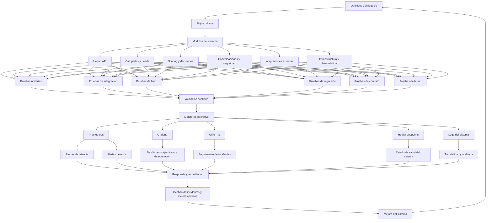

# Diagrama general de monitoreo, control, pruebas y seguimiento

## 1. Visión general

Este diagrama representa el modelo operativo del proyecto para garantizar calidad, control de errores, trazabilidad y seguimiento del estado del sistema desde el desarrollo hasta la operación.

## 2. Descripción funcional de cada bloque

### 2.1 Objetivos del negocio
Representan las metas del proyecto: automatizar campañas, mejorar conversión, garantizar calidad, controlar errores y mantener operatividad.

### 2.2 Flujos críticos
Los flujos que deben sostenerse en producción:
- crear campaña
- cargar leads
- scoring
- conversaciones
- webhooks
- sincronización con terceros

### 2.3 Módulos del sistema
- Helper API: orquestación principal
- Campañas y Leads: motor comercial
- Scoring y decisiones: priorización
- Conversaciones y seguridad: control de interacción
- Integraciones externas: conectividad
- Infraestructura y observabilidad: estabilidad operativa

### 2.4 Pruebas
Cada módulo debe pasar por un conjunto de pruebas que validen:
- correcto funcionamiento
- ausencia de regresiones
- estabilidad tras cambios
- compatibilidad con integraciones externas
- comportamiento esencial tras deploy

### 2.5 Monitoreo operativo
Se usa para ver el estado real del sistema en tiempo real:
- Prometheus: métricas
- Grafana: dashboards y visualización
- GlitchTip: errores y excepciones
- Health endpoints: disponibilidad básica
- Logs: trazabilidad y diagnóstico

### 2.6 Gestión y remediación
Cuando ocurre un fallo, el sistema debe permitir:
- detectar el problema
- clasificarlo
- asignarlo a un responsable
- corregirlo
- validar la solución
- cerrar el incidente con evidencia

## 3. Estandar recomendado de seguimiento

### 3.1 Para cada incidente o falla
- registrar timestamp
- indicar módulo afectado
- indicar flujo involucrado
- registrar severidad
- identificar dependencia externa si aplica
- adjuntar evidencia de prueba o logs

### 3.2 Para cada release o cambio
- ejecutar pruebas unitarias
- ejecutar pruebas de integración
- ejecutar pruebas de regresión
- ejecutar pruebas de humo
- revisar métricas y alertas

## 4. Mapa de módulos y sus funciones de control

| Módulo | Función | Qué monitorear | Herramienta sugerida |
|---|---|---|---|
| Helper API | orquestación de negocio | latencia, 4xx/5xx, health | Prometheus + Grafana |
| Campañas | gestión del ciclo comercial | creación, start/pause/complete, fallos | Prometheus + logs |
| Leads | carga y estado | errores de carga, duplicados, scoring | logs + métricas |
| Scoring | priorización | excepciones, reglas, resultados | logs + alertas |
| Conversaciones | seguridad y control | bloqueos, transiciones inválidas | GlitchTip + logs |
| Integraciones | conexión con terceros | timeouts, errores de contrato, disponibilidad | GlitchTip + Prometheus |
| Infraestructura | estabilidad general | CPU, RAM, containers, conectividad | Prometheus + Grafana |

## 5. Qué debes ver en cada módulo

### Helper API
- estado de salud general
- latencia por endpoint
- errores por ruta
- SLI y SLO

### Campañas y Leads
- volumen procesado
- fallos de creación o carga
- tiempo de ejecución
- estado final del lead o campaña

### Scoring
- tasa de evaluación
- resultados fuera de rango
- excepciones durante evaluación

### Conversaciones y Seguridad
- bloqueos por seguridad
- transiciones inválidas
- patrones sospechosos

### Integraciones externas
- disponibilidad del servicio externo
- tiempo de respuesta
- porcentaje de fallos por contrato

### Infraestructura
- estado de containers
- consumo de recursos
- errores de red y conexión

## 6. Recomendación operativa final

Para que este sistema sea realmente confiable, debes usar el siguiente modelo:

1. pruebas automáticas en cada cambio
2. monitoreo continuo en producción y desarrollo
3. alertas tempranas sobre degradación
4. registro estructurado de errores
5. revisión periódica de incidentes y métricas
6. mejora continua basada en evidencia

Con este modelo puedes confiar en que el proyecto tendrá un control robusto, seguimiento claro y una base de calidad estandarizada.
