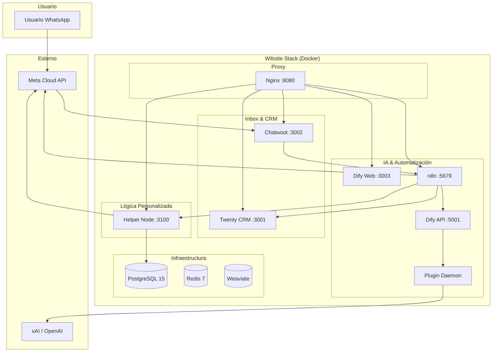

# Arquitectura General

## Diagrama de Arquitectura

## Stack
- **Orquestación**: Docker Compose (20 servicios, incl. Elasticsearch/Kibana/OTel Collector/MinIO)
- **Base de datos**: PostgreSQL 15 con pgvector
- **Cache/Queue**: Redis 7 Alpine
- **Vector Store**: Weaviate 1.26.1 + Transformers (sentence-transformers-multi-qa-MiniLM-L6-cos-v1)
- **Inbox**: Chatwoot (Rails, web UI en puerto 3002)
- **IA/Workflows**: Dify 1.15.x (API + Web + Worker)
- **Modelos**: Plugin-daemon (marketplace dify) + provider openai_api_compatible
- **Orquestador**: n8n (workflows visuales, puerto 5679)
- **CRM**: Twenty CRM (puerto 3001)
- **Proxy**: Nginx (puerto 8080, unifica todos los servicios)
- **Lógica personalizada**: Helper Node Express.js (puerto 3100)

## Puertos Expuestos
| Puerto | Servicio |
|--------|----------|
| 8080 | Nginx (punto de entrada unificado) |
| 3001 | Twenty CRM |
| 3002 | Chatwoot |
| 3003 | Dify Web |
| 5001 | Dify API |
| 5002 | Plugin Daemon |
| 5679 | n8n |
| 3100 | Helper Node |

## Redes
- Todos los servicios en la red interna de Docker Compose (`wibsite_default`)
- Las rutas entre servicios usan nombres de contenedor (ej: `http://dify-api:5001`)

## Flujo Principal (Mensaje Entrante)
1. Usuario envía WhatsApp → Meta Cloud API
2. Meta → Chatwoot (inbox WhatsApp)
3. Chatwoot → n8n (webhook: message_created)
4. n8n → Dify (workflow: clasificar lead)
5. Dify → n8n (respuesta + clasificación)
6. n8n → Chatwoot (respuesta al usuario vía API)
7. n8n → Twenty CRM (crear/actualizar lead)
8. helper-node → tracking de campañas

## Flujo de Campañas (Broadcast)
1. n8n (trigger) → helper-node (GET /campaigns/pending)
2. n8n → Twenty CRM (GET contacts por filtro)
3. n8n → Dify (generar contenido personalizado)
4. n8n → Meta WhatsApp API (enviar mensajes)
5. Meta → helper-node (webhook status: delivered/read/failed)
6. helper-node → tracking de entregas
